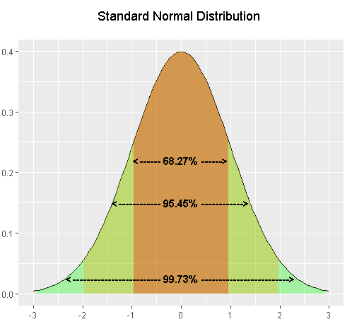
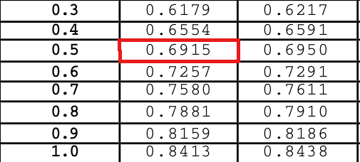
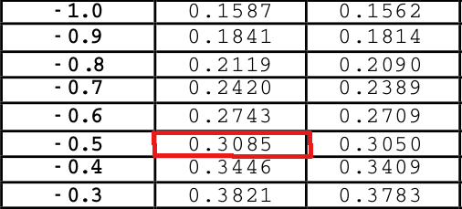

```{r setup, include=FALSE}
knitr::opts_chunk$set(echo = TRUE,
                      warning = FALSE,
                      eval = TRUE,
                      message = FALSE,
                      fig.align = "center")

library(ggplot2)
tema_gg <- theme_linedraw() +
  theme(axis.title.x = element_text(size = 5),
        axis.title.y = element_text(size = 5),
        plot.title = element_text(size = 8))
```

## Distribución Exponencial (1/4)

  - De gran utilidad para modelar fenómenos relacionados con tiempos de espera.
  - Múltiples aplicaciones:
      - Calcular la probabilidad de que un instrumento electrónico falle en determinado período de tiempo.
      - El tiempo necesario para que ocurra un accidente de tránsito en una ruta en una vía con probabilidad $P$.
      - El tiempo que puede transcurrir en un servicio de urgencias para que llegue el próximo paciente.
      - Teoría de colas
      - Problemas de confiabilidad
  - En un proceso Poisson donde se repite sucesivamente un experimento a intervalos de tiempo iguales, el tiempo que transcurre entre dos sucesos sigue un modelo probabilístico exponencial.

## Distribución Exponencial (2/4)

Una variable aleatoria $X$ tiene distribución Exponencial si su función de densidad es: $$f(x) = \lambda e^{-\lambda x}$$

Notación:
$$X \sim Exp(\lambda)$$

  - **Esperanza Matemática:**

$$E[X]=\frac{1}{\lambda}$$

- **Varianza:**

$$Var[X]=\frac{1}{\lambda^2}$$

## Distribución Exponencial (3/4) 

- **Ejemplo:** de registros históricos se sabe que en promedio, un rayo causa la muerte a tres personas cada año en determinado país. Obtener:
    - La probabilidad de que el tiempo hasta la próxima muerte sea menor a un año.
    - La probabilidad de que el tiempo hasta la próxima muerte sea mayor a 18 meses.

Funciones importantes:

  - `rexp()`: generar números bajo la distribución Exponencial
  - `dexp()`: función de densidad
  - `pexp()`: probabilidad acumulada.
  - `qexp()`: obtener cuantiles

## Distribución Exponencial (4/4) 
  
```{r}
#P(X < 1)
pexp(q = 1, rate = 3, lower.tail = TRUE)

#P(X > 1.5)
pexp(q = 1.5, rate = 3, lower.tail = FALSE)

#P(X > 1.5)
1 - pexp(q = 1.5, rate = 3, lower.tail = TRUE)
```

## Distribución Normal (1/7)

  - De gran utilidad para múltiples fenómenos de la vida real
      - Agronómicos
      - Biológicos
      - Químicos
      - Físicos
      - Antropológicos
  - Centralizada en la media
  - La curva tiene su máximo absoluto en $\mu$
  - La curva es simétrica a través de $\mu$
  - Se aproxima al eje horizontal sin tocarlo (curva asintótica)
  - El área total bajo la curva es 1

## Distribución Normal (2/7)

Una variable aleatoria $X$ tiene distribución Normal si su función de densidad es: $$f(x) = \frac{1}{\sqrt{2 \pi \sigma}}e^{-\frac{(x - \mu)^2}{2 \sigma^2}};\ con\ \sigma > 0$$

Notación:
$$X \sim N(\mu,\ \sigma^2)$$

  - **Esperanza Matemática:**

$$E[X]=\mu$$

  - **Varianza:**

$$Var[X]=\sigma^2$$

## Distribución Normal (3/7)

  - Obtener la probabilidad de que una variable aleatoria $X$ tome valores menores a un valor determinado.

```{r, echo=FALSE, fig.height=2.9, fig.width=4.2, collapse=TRUE}
x <- seq(-4, 4, length = 200)
y <- dnorm(x)
plot(x,y,type = "l", lwd = 2, col = "red")
x <- seq(-4, 1, length = 200)
y <- dnorm(x)
polygon(c(-4, x, 1), c(0, y, 0), col = "gray")
```

## Distribución Normal (4/7)

  - Obtener la probabilidad de que una variable aleatoria $X$ tome valores mayores a un valor determinado.

```{r, echo=FALSE, fig.height=2.9, fig.width=4.2, collapse=TRUE}
x <- seq(-4, 4, length = 200)
y <- dnorm(x)
plot(x,y,type = "l", lwd = 2, col = "red")
x <- seq(4, 1, length = 200)
y <- dnorm(x)
polygon(c(4, x, 1), c(0, y, 0), col = "gray")
```

## Distribución Normal (5/7)

  - Obtener la probabilidad de que una variable aleatoria $X$ tome valores entre dos valores determinados.

```{r, echo=FALSE, fig.height=2.9, fig.width=4.2, collapse=TRUE}
x <- seq(-4, 4, length = 200)
y <- dnorm(x)
plot(x,y,type = "l", lwd = 2, col = "red")
x <- seq(-2, 2, length = 200)
y <- dnorm(x)
polygon(c(-2, x, 2), c(0, y, 0), col = "gray")
```

## Distribución Normal (6/7)

```{r, echo=FALSE, fig.height=3.2, fig.width=5, collapse=TRUE}
mu<-c(0,2,4,-5);
curve(dnorm(x),xlim=c(-10,10),main=expression('Distribución Normal '*sigma==1),lwd=2,
     ylab='Densidad')
curve(dnorm(x,2,1),col=2,lwd=2,add=T)
curve(dnorm(x,4,1),col=3,lwd=2,add=T)
curve(dnorm(x,-5,1),col=4,lwd=2,add=T)
for(i in 1:4){polygon(c(mu[i],mu[i]),c(0,dnorm(mu[i],mu[i],1)),border=i,lty=4,lwd=2)}
legend('toprigh',lty=1,col=1:4,lwd=2,legend=c(expression(mu==0),expression(mu==2),
                                              expression(mu==4),expression(mu==-5)), bty = "n")
```

## Distribución Normal (7/7)

```{r, echo=FALSE, fig.height=3.2, fig.width=5, collapse=TRUE}
sig<-c(1,0.7,2);sig<-cbind(-sig,sig)
curve(dnorm(x),lwd=2,ylim=c(0,0.6),xlim = c(-5,5),ylab='Densidad',
     main=expression('Distribución Normal '*mu==0))
curve(dnorm(x,0,sig[2,2]),col=2,lwd=2,add=T)
curve(dnorm(x,0,sig[3,2]),col=3,lwd=2,add=T)
for(i in 1:3){polygon(sig[i,],dnorm(sig[i,],0,sig[i,2]),border = i,lty=4,lwd=2)}
legend('toprigh',lty=1,col=1:3,lwd=2,legend=c(expression(sigma==1),expression(sigma==0.7),
                                              expression(sigma==2)), bty = "n")
```

## Distribución Normal Estándar (1/7)

Notación:
$$Z \sim N(\mu=0,\ \sigma^2=1)$$

- **Estandarización:**

$$z = \frac{X - \mu}{\sigma}$$

- **Tabla Z:**

[Tabla Z - Distribución normal estándar.](https://bioestadistica.github.io/Temas/Z.pdf)

## Distribución Normal Estándar (2/7)

```{r, out.width = "300px", out.height="180px", echo=FALSE}

```

## Distribución Normal Estándar (3/7)

- **Ejemplo:** Si $X$ sigue una distribución normal con media igual a 10 y sigma igual a 2. ¿Cuál es la probabilidad de que la medida de la variable aleatoria $X$ esté entre 9 y 11?

## Distribución Normal Estándar (4/7)

  1. **Estandarizar**
  
$$P(9 < X < 11) = P(\frac{9-10}{2} < \frac{x-10}{2} < \frac{11-10}{2})$$
$$P(-0.5 < z < 0.5) = P(z < 0.5) - P(z < -0.5) = 0.38292$$

## Distribución Normal Estándar (5/7)

```{r, out.width = "300px", out.height="180px", echo=FALSE}

```  

## Distribución Normal Estándar (6/7)

```{r, out.width = "300px", out.height="180px", echo=FALSE}

```  

$$0.6915 - 0.3085 = 0.383$$    

## Distribución Normal Estándar (7/7)

  2. **Con R**
  
Funciones importantes:

  - `rnorm()`: generar números bajo la distribución Exponencial
  - `pnorm()`: función de densidad (probabilidades)
  - `qnorm()`: obtener cuantiles

```{r, collapse=TRUE}
pz_menor0.5 <- pnorm(q = 0.5)
pz_menor_menos0.5 <- pnorm(q = -0.5)
pz_menor0.5 - pz_menor_menos0.5
```

## Distribución Chi Cudrado ($\chi^2$)

  - Llamada también *ji cuadrada (o)* o distribución de Pearson
  - Aplicación considerable en la teoría y metodología estadística
  - Componente importante de las pruebas de hipótesis e inferencia estadística
  - Relacionada con las distribuciones T de Student y F de Snedecor

Una variable aleatoria $X$ tiene distribución chi cuadrado si su función de densidad es: $$\frac{1}{2^{\frac{k}{2}}\Gamma(k/2)}x^{(k/2)-1}e^{-x/2}$$

Notación: $$X \sim \chi^2(k)$$

- **Esperanza Matemática y Varianza:**

  - $E[X] = k$
  - $Var[X] = 2k$

# Distribución de estadísticos muestrales

## Muestreo

  - El muestreo tiene como objetivo inferir propiedades de una población a partir de una fracción de ella, conocida como muestra.
  - Desde el punto de vista estadístico el objetivo es conocer los parámetros de la distribución de la variable de interés.
  - Los estadísticos muestrales sirven como aproximación (estimación) de los parámetros que caracterizan la distribución.
  - Los estadísticos son desconocidos, por tanto, se consideran variables aleatorias y como tales, tienen una distribución asociada.

# Distribuciones derivadas del muestreo

## Distribución *t* de Student (1/2)

  - Deriva de la distribución normal
  - Surge con la dificultad de estimar la media de una población con distribución normal cuando el tamaño de muestra es pequeño.
  - Notación: $X \sim t(v)$
  - Es de media cero y varianza $\frac{v}{v-2};\ con\ v > 2$
  - Simétrica respecto a la media
  - La varianza decrece hasta uno cuando el número de grados de libertad aumenta
  - [Tabla *t*](https://bioestadistica.github.io/Temas/t.pdf)

## Distribución *t* de Student (2/2)

```{r, echo=FALSE, fig.height=3.2, fig.width=5, collapse=TRUE}
curve(dnorm(x),xlim=c(-5,5),main='Distribución t-Student',ylab='Densidad',lwd=2)
curve(dt(x,df = 1),col=2,add=T,lwd=2)
curve(dt(x,df = 2),col=3,add=T,lwd=2)
curve(dt(x,df = 5),col=4,add=T,lwd=2)

legend('toprigh',lty=1,col=1:4,lwd=2,cex=0.9,
       legend=c('Normal (0,1)','Cauchy','t(v=2)','t(v=5)'), bty = "n")
```

## Distribución F

  - Llamada la distribución F de Fisher o F de Snedecor.
  - Generalmente es la distribución nula de una prueba estadística (análisis de varianza)
  - Notación: $X \sim F_(k_1,\ k_2)$
  - Útil en comparación de varianzas
  - [Tabla F](https://bioestadistica.github.io/Temas/F.pdf)

La distribución F surge como resultado de la siguiente operación entre variables aleatorias: $$F = \frac{Y_1/k_1}{Y_2/k_2}$$

Donde:

  - $Y_1$ y $Y_2$ siguen una distribución $\chi^2$ con $k_1$ y $k_2$ grados de libertad, respectivamente.
  - $Y_1$ y $Y_2$ son independientes

## Ejercicios (1/5)

En un experimento de laboratorio se utilizan 10 gramos de $X$ compuesto químico, se conoce que la duración media de un átomo de esta materia es de 140 días; obtener:

  a. La probabilidad de que el compuesto desaparezca máximo a los 100 días.
  b. La probabilidad de que el compuesto desaparezca en mínimo 50 días
  c. Los días que transcurren hasta que haya desaparecido el 90% de este material.
  
```{r, echo=FALSE}
# Respuesta A
pexp(q = 100, rate = 1/140)
```

```{r, echo=FALSE}
#Respuesta B
pexp(q = 50, rate = 1/140, lower.tail = FALSE)
```

```{r, echo=FALSE}
#Respuesta C (en días)
qexp(p = 0.90, rate = 1/140)
```

## Ejercicios (2/5)

  - Se ha comprobado que el tiempo de vida útil de cierto tipo de marcapasos sigue una distribución exponencial con media de 16 años. Obtener:
    + La probabilidad de que a un paciente al que se le ha implantado el marcasos, deba reemplazarlo por otro antes de 20 años.
    + La probabilidad de que haya que cambiar el marcapasos máximo a los 25 años en un paciente que tiene el implante hace 5 años.
    + El tiempo transcurrido hasta que exista una probabilidad máximo del 80% de reemplazarlo.

```{r, echo=FALSE}
Respuesta_A <- pexp(q = 20, rate = 1/16)
Respuesta_B <- pexp(q = 25, rate = 1/16) - pexp(q = 5, rate = 1/16)
Respuesta_C <- qexp(p = 0.80, rate = 1/16)
```

```{r, collapse=TRUE}
Respuesta_A
Respuesta_B
Respuesta_C
```

## Ejercicios (3/5)

  - Asuma que la variable aleatoria $Z$ sigue una distribución normal estándar, obtener:
      a. $P(Z \leq 1.37)$ (`r pnorm(q = 1.37, mean = 0, sd = 1)`)
      b. $P(Z \leq -0.86)$ (`r pnorm(q = -0.86, mean = 0, sd = 1)`)
      c. $P(-1.25 \leq Z \leq 0.37)$ (`r abs(pnorm(q = -1.25, mean = 0, sd = 1)-pnorm(q = 0.37, mean = 0, sd = 1))`)
      d. $P(Z > -1.23)$ (`r 1 - pnorm(q = -1.23)`)

## Ejercicios (4/5)
      
- El caudal de un canal de riego medido en $m^3/seg$ es una variable aleatoria con distribución aproximadamente normal con media $3m^3/seg$ y desviación estándar de $0.8m^3/seg$. Con esta información, obtener la probabilidad de los siguientes eventos:
    - **Evento A:** que el caudal en un momento dado sea máximo de $2.4m^3/seg$. (`r pnorm(q = 2.4, mean = 3, sd = 0.8)`)
    - **Evento B:** que el caudal en un momento dado esté entre $2.8\ y\ 3.4m^3/seg$. (`r pnorm(q = 3.4, mean = 3, sd = 0.8) - pnorm(q = 2.8, mean = 3, sd = 0.8)`)
    - **Evento C:** que el caudal en un momento dado sea al menos de $2m^3/seg$. (`r pnorm(q = 2, mean = 3, sd = 0.8, lower.tail = FALSE)`) 

## Ejercicios (5/5)    

- El día de floración de una hortaliza (en escala de 1 -365 días) se puede modelar con una distribución normal centrada en el 18 de agosto (día 230) y con desviación estándar de 10 días. Si desde la fecha de la floración hasta la cosecha hay un lapso de 25 días, obtener:
    a. La proporción de la cosecha que se habrá generado para el 16 de septiembre (día 259).
    b. Si se considera **primicia** a los frutos obtenidos antes del 1 de septiembre (día 244), ¿qué proporción de la cosecha se espera sea primicia?
    c. Si se considera **tardío** a los frutos obtenidos después del 20 de septiembre (día 263), ¿cuál es la proporción esperada de frutos tardíos?
    
```{r, echo=FALSE}
Respuesta_A <-  pnorm(q = 259, mean = 255, sd = 10)
Respuesta_B <- pnorm(q = 244, mean = 255, sd = 10)
Respuesta_C <- pnorm(q = 263, mean = 255, sd = 10, lower.tail = FALSE)
```

```{r, collapse=TRUE}
Respuesta_A
Respuesta_B
Respuesta_C    