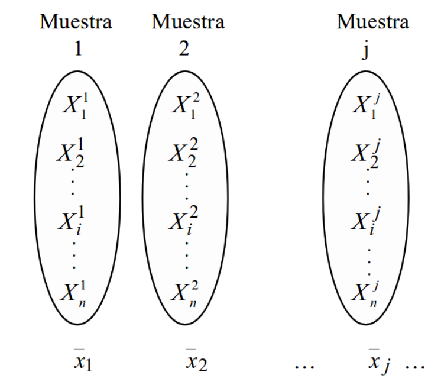
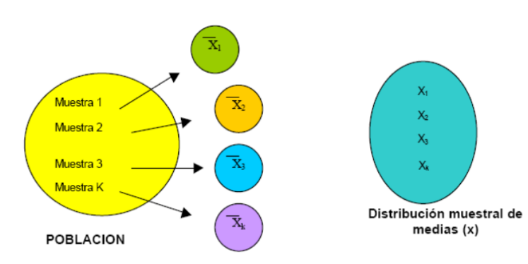

```{r setup, include=FALSE}
knitr::opts_chunk$set(echo = TRUE,
                      warning = FALSE,
                      eval = TRUE,
                      message = FALSE,
                      fig.align = "center")

library(ggplot2)
tema_gg <- theme_linedraw() +
  theme(axis.title.x = element_text(size = 5),
        axis.title.y = element_text(size = 5),
        plot.title = element_text(size = 8))
```

## Distribución de la media muestral (1/4)

```{r, echo=FALSE, out.width = "270px", out.height="140px"}

```

## Distribución de la media muestral (2/4)

```{r, echo=FALSE, out.width = "270px", out.height="160px"}

```

## Distribución de la media muestral (3/4)

  - La variable aleatoria $\bar{X}$ toma valores $\bar{X_1}$, $\bar{X_2}$, ..., $\bar{X_j}$.
  - **Esperanza matemática:** $E[X] = \mu_{\bar{X}}$
  - **Varianza:** $Var[X] = \frac{\sigma}{\sqrt{n}}$
  
## Distribución de la media muestral (4/4) 

**Casos particulares:**

  - Varianza poblacional $\sigma^2$ conocida.
  - Varianza poblacional $\sigma^2$ desconocida (muestras pequeñas).
  - Varianza poblacional $\sigma^2$ desconocida (muestras grandes).
  
## $\sigma^2$ conocida

- Si $\bar{X}$ se distribuye de forma normal: $$\bar{X} \sim\ N(\bar{X}, \frac{\sigma}{\sqrt{n}})$$

- Entonces $Z$: $$Z = \frac{\bar{X} - \mu}{\sigma/\sqrt{n}} \sim\ N(\mu = 0, \sigma = 1)$$

## $\sigma^2$ desconocida (muestras pequeñas)

- El estadístico $T$ definido como: $$T = \frac{\bar{X} - \mu}{S/\sqrt{n}}$$

- Tiene distribución $t-student$ con $n-1$ grados de libertad: $$T = \frac{\bar{X} - \mu}{S/\sqrt{n}} \sim\ t_{n-1}$$

- $S$ es la desviación muestral.

##  $\sigma^2$ desconocida (muestras grandes)

- El estadístico $T$ definido como: $$T = \frac{\bar{X} - \mu}{S/\sqrt{n}}$$

- Tiene distribución normal estándar: $$T = \frac{\bar{X} - \mu}{S/\sqrt{n}} \sim\ N(\mu = 0, \sigma = 1)$$

- $S$ es la desviación muestral.