```{r setup, include=FALSE}
knitr::opts_chunk$set(echo = TRUE,
                      warning = FALSE,
                      eval = TRUE,
                      message = FALSE,
                      fig.align = "center")

library(ggplot2)
tema_gg <- theme_linedraw() +
  theme(axis.title.x = element_text(size = 5),
        axis.title.y = element_text(size = 5),
        plot.title = element_text(size = 8))
```

# Inferencia Estadística

## Inferencia

```{r, echo=FALSE, out.width = "250px", out.height="140px"}
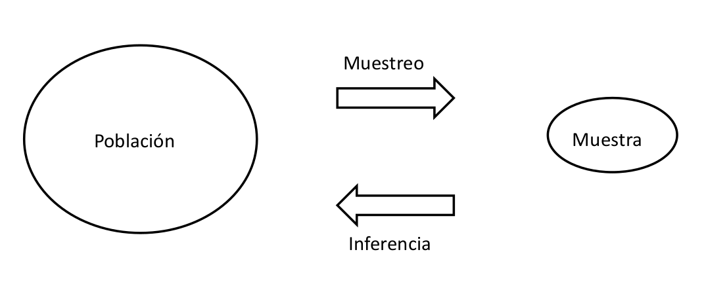
```

## Inferencia

  - Métodos de inferencia estadística:
      - Clásico
      - Bayesiano
  - Inferencia:
      - Estimación
          - Puntual
          - Intervalos
      - Pruebas de hipótesis

## Introducción

  - **Parámetro:** medida numérica que se obtiene con todos los datos de la población. Los parámetros generalmente son desconocidos.
  - **Estadístico:** medida numérica que se obtiene de las muestras con determinado nivel de variación entre muestras.
  - **Inferencia estadística:** proceso mediante el cual se generalizan conclusiones a la población, cuyo punto de partida son las muestras. Objetivos de la inferencia estadística:
      - Estimación de parámetros
          - Estimación puntual
          - Intervalos de confianza
      - Pruebas de hipótesis o test de significancia estadística
  - Un estadístico muestral, proveniente de una muestra aleatoria, tiene un patrón de comportamiento (predecible) en repetidas muestras, dicho patrón se conoce como la distribución muestral del estadístico.
  - Si se conoce la distribución muestral, es posible hacer inferencia estadística.
  
## Elementos básicos de inferencia estadística (1/3)

  - **Punto de partida:** situaciones cotidianas que afectan la realidad del hombre.
  - Tomar acciones frente a dichas situaciones requiere comprensión del sistema que las origina.
  - **Etapa de “idealización”:** modelación.
      - La modelación tiene como objetivo identificar los elementos que son importantes y determinar sus relaciones.
  - Si el modelo es correcto, se constituye como una herramienta útil para planificar acciones.

## Elementos básicos de inferencia estadística (2/3)
  
**Relación entre la construcción de modelos y la inferencia estadística:**

- Un modelo deber ser validado, es decir, mostrar que las estimaciones que se deducen del mismo, son aceptables.
- Un modelo se considera correcto para determinada situación, cuano no existen diferencias significativas entre lo observado y lo esperado.
- ¿Qué es diferencia significativa?
    - Asignación de probabilidades al evento
    - La medida de probabilidad permitirá tomar la decisión basado en la evidencia observada

## Elementos básicos de inferencia estadística (3/3)

  - Hipótesis científica: modelo no validado
      - Si las consecuencias de la hipótesis científica se puede establecer como propiedades estadísticas de una variable aleatoria, entonces será posible implementar herramientas de inferencia estadística que permitan la validación del modelo.
      - Hipótesis científica en términos estadísticos como Hipótesis Estadística
          - Analizar datos muestrales
          - Cálculo de estadísticos muestrales
          - Distribución del estadístico muestral
          - La distribución del estadístico depende de la hipótesis planteada
          - Se rechaza o no la hipótesis estadística y, en consecuencia, la hipótesis científica
          
# Estimación de paramétros

## Estimación puntual

```{r, echo=FALSE, out.width = "250px", out.height="140px"}
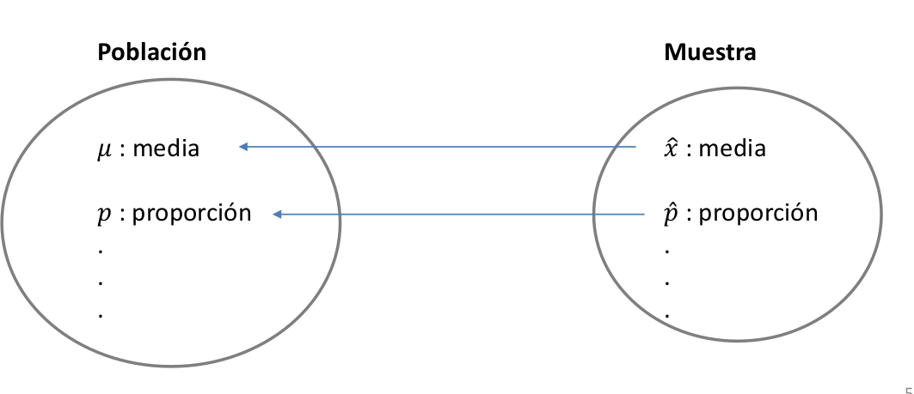
```

## Estimación por intervalo

```{r, echo=FALSE, out.width = "250px", out.height="140px"}
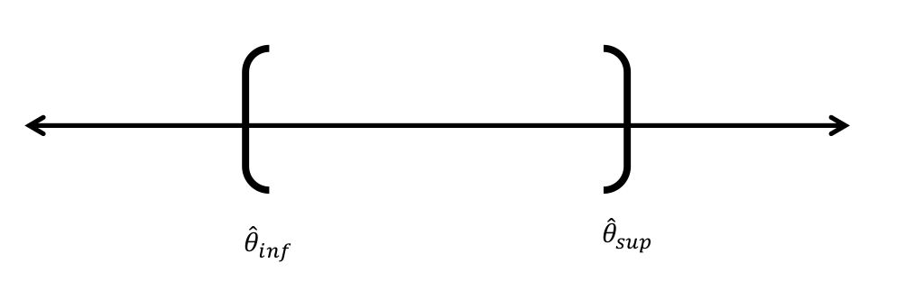
```

## Nivel $\alpha$ y Nivel de confianza (NC)

  - Nivel $\alpha$ de uso frecuente:
      - 0.10
      - 0.05
      - 0.01
  - Nivel de confianza de uso frecuente:
      - 0.90
      - 0.95
      - 0.99
  - $NC + \alpha = 1$

## Ilustración de IC
      
**Ejemplo con un $NC = 97\%(0.97)$ y $\alpha = 3\%(0.03)$**

```{r, echo=FALSE, out.width = "250px", out.height="140px"}
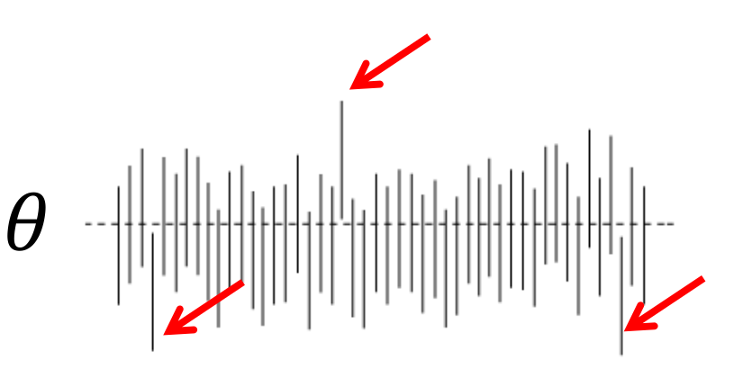
```

## Intervalos de confianza usuales

  - Para una muestra:
      - $\mu$
      - $p$
      - $\sigma^2$
  - Para dos muestras:
      - $\mu_1 - \mu_2$
      - $\mu_1 - \mu_2\ (pareadas)$
      - $p_1-p_2$
      - $\sigma^2_1/\sigma^2_2$

# Pruebas de hipótesis

## Tipos de hipótesis

```{r, echo=FALSE, out.width = "250px", out.height="140px"}
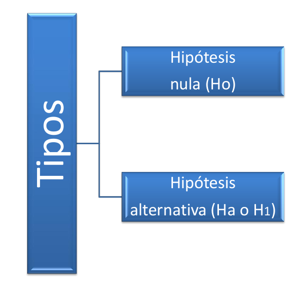
```

## Tipos de pruebas

```{r, echo=FALSE, out.width = "250px", out.height="100px"}
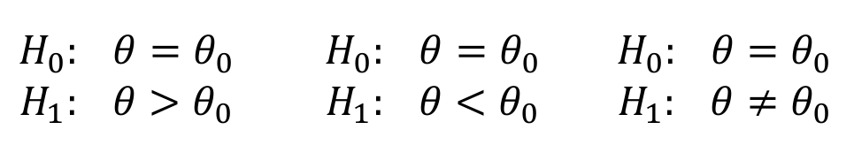
```

## Área de aceptación

```{r, echo=FALSE, out.width = "250px", out.height="140px"}
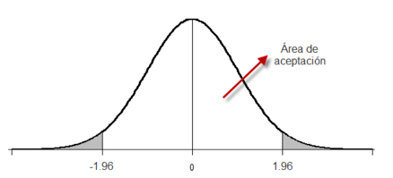
```

## Pruebas de hipótesis usuales

  - Para una muestra:
      - $\mu$
      - $p$
      - $\sigma^2$
  - Para dos muestras:
      - $\mu_1 - \mu_2$
      - $\mu_1 - \mu_2\ (pareadas)$
      - $p_1-p_2$
      - $\sigma^2_1/\sigma^2_2$

## Proceso de prueba de hipótesis

  - Definir la hipótesis nula y la alternativa
  - Tomar la muestra (muestreo)
  - Calcular el estadístico (evidencias)
  - Determinar el nivel $\alpha$    
  - Calcular el valor P
  - Concluir (toma de decisiones)
  
## Tipos de errores en pruebas de hipótesis

```{r, echo=FALSE, out.width = "250px", out.height="140px"}
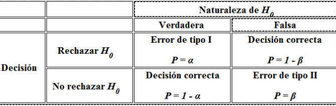
```

  - $\alpha$: máxima probabilidad de cometer el error tipo I
  - **Potencia de la prueba ($1- \beta$):** probabilidad de rechazar una hipótesis nula que es falsa. 

## Valor P: concepto

  - Se puede definir como la probabilidad exacta de cometer el error tipo I.
  - Probabilidad de obtener un estadístico de prueba (evidencias) igual al que se obtuvo o más extremo.
  - Es la probabilidad calculada, suponiendo que la hipótesis nula es verdadera, de obtener un estadístico de prueba tan discrepante a $H_0$ como el valor que en realidad se obtuvo.
  - En la medida que el valor P se hace más pequeño, más contradictorios son los datos con $H_0$

## ¿Dónde se encuenta el valor P?

```{r, echo=FALSE, out.width = "250px", out.height="140px"}
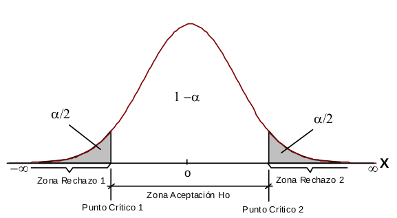
```

## ¿Dónde se encuenta el valor P?

```{r, echo=FALSE, out.width = "250px", out.height="140px"}
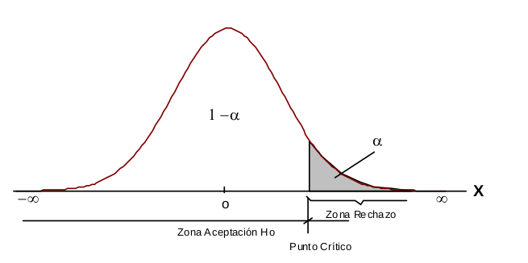
```

## ¿Dónde se encuenta el valor P?

```{r, echo=FALSE, out.width = "250px", out.height="140px"}
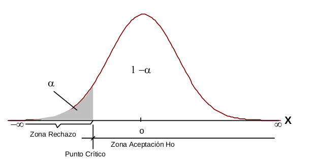
```

## Conclusión en una prueba de hipótesis

```{r, echo=FALSE, out.width = "250px", out.height="140px"}
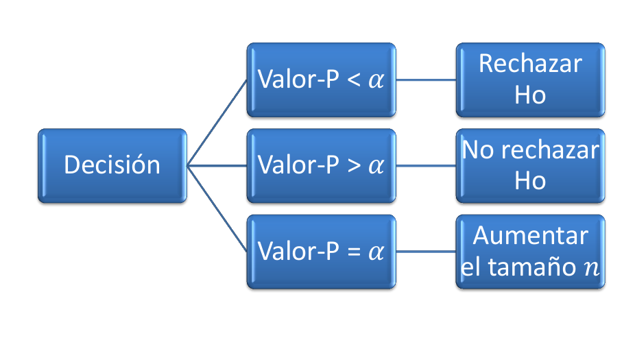
```

## Formas de contrastar una hipótesis

  - Intervalos de confianza
  - Región de rechazo
  - Valor P
