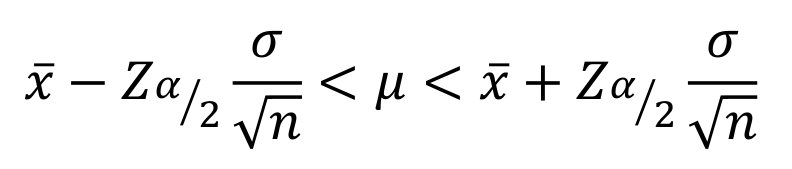
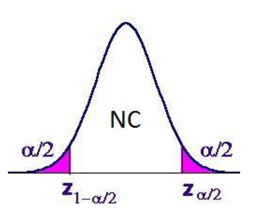
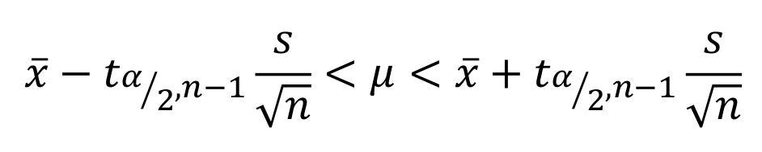

```{r setup, include=FALSE}
knitr::opts_chunk$set(echo = TRUE,
                      warning = FALSE,
                      eval = TRUE,
                      message = FALSE,
                      fig.align = "center")

library(ggplot2)
tema_gg <- theme_linedraw() +
  theme(axis.title.x = element_text(size = 5),
        axis.title.y = element_text(size = 5),
        plot.title = element_text(size = 8))
```

# Inferencia sobre $\mu$

## Prueba de hipótesis para $\mu$

  1. Comprobar que la variable aleatoria se distribuye de forma normal.
  2. Definir la hipóteis nula y alternativa: $$H_0: nula$$
   $$H_1: alternativa$$
  3. Calcular el estadístico $$t = \frac{\bar{X}- \mu_0}{s/\sqrt{n}}$$
  4. Definir el error tipo I $\alpha$
  5. Calcular el valor P en una distribución $t-student$ con $n-1$ grados de libertad
  6. Comparar el valor P con $\alpha$ y concluir.

# Intervalos de confianza para $\mu$

## IC para $\mu$ con $\sigma$ conocida (1/2)

Si $\bar{x}$ es la media de una muestra aleatoria de tamaño $n$ de una población normal con varianza $\sigma^2$ conocida, un intervalo de confianza del $(1-\alpha)100\%$ para $\mu$ está dado por la siguiente expresión:

```{r, echo=FALSE, out.width = "250px", out.height="50px"}

```

## IC para $\mu$ con $\sigma$ conocida (2/2)

```{r, echo=FALSE, out.width = "210px", out.height="110px"}

```

  - Nivel de confianza (NC) y $\alpha$: $Z_{\alpha/2}$:
      - $NC = 90\%,\ y\ \alpha = 0.10: Z_{\alpha/2} = 1.645$
      - $NC = 95\%,\ y\ \alpha = 0.05: Z_{\alpha/2} = 1.960$
      - $NC = 99\%,\ y\ \alpha = 0.01: Z_{\alpha/2} = 2.576$

## IC para $\mu$ con $\sigma$ desconocida

Si $\bar{x}$ es la media de una muestra aleatoria de tamaño $n$ de una población normal con varianza $\sigma^2$ desconocida, un intervalo de confianza del $(1-\alpha)100\%$ para $\mu$ está dado por la siguiente expresión:

```{r, echo=FALSE, out.width = "250px", out.height="50px"}

```

# Ejemplo para $\mu$

## Ejemplo con libras de arroz

  - **Objetivo:** comprobar a través de inferencia estadística si las libras de arroz en efecto traen 500 gramos.
  - Pese las $n$ libras colectadas en clase.
  - Estructure el vector o base de datos.
  - Defina la hipóteis nula y alternativa: $$H_0: \mu_{arroz} = 500g$$
   $$H_A: \mu_{arroz} \neq 500g$$
  - Calcular el estadístico.
  - Definir el error tipo I $\alpha$
  - Calcular el valor P en una distribución $t-student$ con $n-1$ grados de libertad
  - Comparar el valor P con $\alpha$ y concluir.
  
  