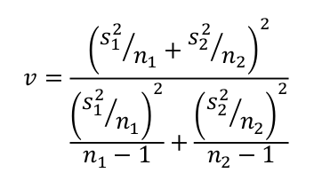
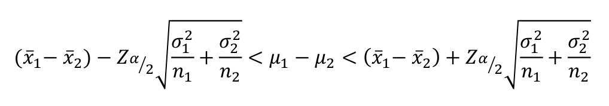
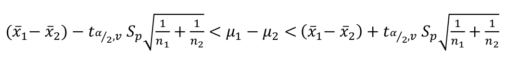
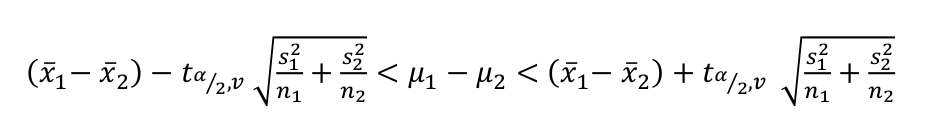

```{r setup, include=FALSE}
knitr::opts_chunk$set(echo = TRUE,
                      warning = FALSE,
                      eval = TRUE,
                      message = FALSE,
                      fig.align = "center")

library(ggplot2)
tema_gg <- theme_linedraw() +
  theme(axis.title.x = element_text(size = 5),
        axis.title.y = element_text(size = 5),
        plot.title = element_text(size = 8))
```

# Inferencia sobre $\mu_1 - \mu_2$

## Hipótesis  $\mu_1 - \mu_2$ con $\sigma$ desconocidas e iguales

1. Comprobar la normalidad.
2. Definir la hipótesis nula y alternativa.
3. Calcular el estadístico
$$t = \frac{\bar{x_1}-\bar{x_2}-\delta_0}{S_p\sqrt{\frac{1}{n_1}+\frac{1}{n_2}}}$$

Donde: 
$$S_p = \frac{(n_1-1)S_1^2+(n_2-1)S_2^2}{n_1+n_2-2}$$

4. Definir el error tipo I $\alpha$
5. Calcular el valor P en una distribución $t-student$ con $n_1+n_2-2$ grados de libertad
6. Comparar el valor P con $\alpha$ y concluir.

## Hipótesis $\mu_1 - \mu_2$ con $\sigma$ desconocidas y diferentes

1. Comprobar la normalidad y la homocedasticidad (igualdad de varianzas)s.
2. Definir la hipótesis nula y alternativa.
3. Calcular el estadístico
$$t = \frac{\bar{x_1}-\bar{x_2}-\delta_0}{\sqrt{\frac{1}{n_1}+\frac{1}{n_2}}}$$

Donde $t \sim t_v$, con grados de libertad $v$:

```{r, echo=FALSE, out.width = "120px", out.height="60px"}

```

4. Definir el error tipo I $\alpha$
5. Calcular el valor P y concluir

# Intervalo de confianza para $\mu_1 - \mu_2$

## IC $\mu_1 - \mu_2$ con $\sigma$ conocida 

Si $\bar{X_1}$ y $\bar{X_2}$ son las medias muestrales de dos muestras aleatorias independientes de tamaño $n_1$ y $n_2$ de poblaciones normales con varianzas conocidas $\sigma^2_1$ y $\sigma^2_2$, respectivamente, un intervalo de confianza del $(1-\alpha)100\%$ para $\mu_1-\mu_2$ está dado por la siguiente expresión:

```{r, echo=FALSE, out.width = "230px", out.height="60px"}

```

## IC $\mu_1 - \mu_2$ con $\sigma$ desconocidas e iguales

Si $\bar{X_1}$ y $\bar{X_2}$ son las medias muestrales de dos muestras aleatorias independientes de tamaño $n_1$ y $n_2$ de poblaciones normales con varianzas iguales y desconocidas, un intervalo de confianza del $(1-\alpha)100\%$ para $\mu_1-\mu_2$ está dado por la siguiente expresión:

```{r, echo=FALSE, out.width = "280px", out.height="65px"}

```

Donde $v = n_1 + n_2 - 2$ y $S_p$:

$$S_p = \frac{(n_1-1)S_1^2+(n_2-1)S_2^2}{n_1+n_2-2}$$

## IC $\mu_1 - \mu_2$ con $\sigma$ desconocidas y diferentes 

Si $\bar{X_1}$ y $\bar{X_2}$ son las medias muestrales de dos muestras aleatorias independientes de tamaño $n_1$ y $n_2$ de poblaciones normales con varianzas iguales y desconocidas, un intervalo de confianza del $(1-\alpha)100\%$ para $\mu_1-\mu_2$ está dado por la siguiente expresión:

```{r, echo=FALSE, out.width = "280px", out.height="65px"}

```

Donde $v$:

```{r, echo=FALSE, out.width = "120px", out.height="60px"}

```

# Ejemplo de $\mu_1 - \mu_2$