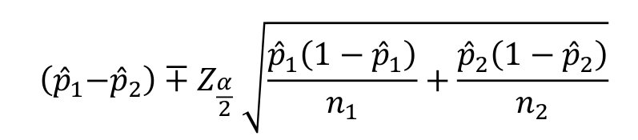

```{r setup, include=FALSE}
knitr::opts_chunk$set(echo = TRUE,
                      warning = FALSE,
                      eval = TRUE,
                      message = FALSE,
                      fig.align = "center")

library(ggplot2)
tema_gg <- theme_linedraw() +
  theme(axis.title.x = element_text(size = 5),
        axis.title.y = element_text(size = 5),
        plot.title = element_text(size = 8))
```

# Inferencia sobre $\hat{p_1}-\hat{p_2}$

## Prueba de hipótesis para $\hat{p_1}-\hat{p_2}$

1. Definir la hipóteis nula y alternativa
3. Calcular el estadístico
$$z = \frac{\hat{p_1}-\hat{p_2}}{\sqrt{\frac{p_1(1-p_1)}{n_1}+\frac{p_2(1-p_2)}{n_2}}}$$
4. Definir el error tipo I $\alpha$
5. Calcular el valor P en una distribución $t-student$ con $n-1$ grados de libertad
6. Comparar el valor P con $\alpha$ y concluir.

## IC para $\hat{p_1}-\hat{p_2}$

Si $\hat{p_1}$ y $\hat{p_2}$ son las proporciones de éxito de dos muestras aleatorias independientes de tamaño $n_1$ y $n_2$, entonces un intervalo del $(1-\alpha)100\%$ para $\hat{p_1}-\hat{p_2}$ está dado por la siguiente expresión:

```{r, echo=FALSE, out.width = "280px", out.height="60px"}

```

# Ejemplo $\hat{p_1}-\hat{p_2}$