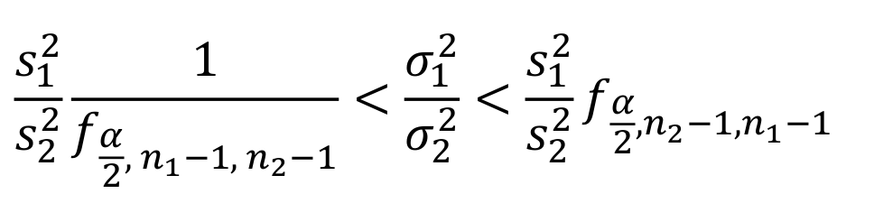

```{r setup, include=FALSE}
knitr::opts_chunk$set(echo = TRUE,
                      warning = FALSE,
                      eval = TRUE,
                      message = FALSE,
                      fig.align = "center")

library(ggplot2)
tema_gg <- theme_linedraw() +
  theme(axis.title.x = element_text(size = 5),
        axis.title.y = element_text(size = 5),
        plot.title = element_text(size = 8))
```

# Inferencia sobre $\sigma^2$

## Prueba de hipótesis para $\sigma_1^2/\sigma_2^2$

**Previamente:**

  - Comprobar normalidad
  - Comprobar homogeneidad de varianzas

**Luego:**

  1. Definir la hipótesis nula y alternativa 
  2. Calcular el estadístico

$$t = \frac{S_1^2}{S_2^2}$$

  3. Definir el error tipo I $\alpha$
  4. Calcular el valor P
  5. Comparar el valor P con $\alpha$ y concluir

## IC para $\sigma^2_1/\sigma^2_2$

Si $S^2_1$ y $S^2_2$ son las varianzas muestrales de muestras aleatorias independientes de tamaño $n_1$ y $n_2$ de poblaciones normales, un intervalo de confianza del $(1-\alpha)100\%$ para $\sigma^2_1/\sigma^2_2$ está dado por la siguiente expresión:

```{r, echo=FALSE, out.width = "280px", out.height="50px"}

```

# Ejemplo $\sigma^2_1/\sigma^2_2$
  