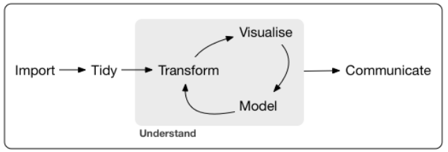

```{r setup, include=FALSE}
knitr::opts_chunk$set(echo = FALSE,
                      warning = FALSE,
                      eval = TRUE,
                      message = FALSE,
                      error = FALSE,
                      out.extra = FALSE,
                      fig.align = "center")
```

```{r, include=FALSE}
options(width = 110, digits = 2)
```

## Motivación

```{r, echo=FALSE, out.width="500", out.height="300"}
knitr::include_graphics("images/Data_Science_VD.png")
```

## Proceso de análisis de datos

```{r, echo=FALSE, out.width="500", out.height="300", fig.cap="http://r4ds.had.co.nz/introduction.html"}

```

## Un poco de historia...

  - Siglo XVI: Girolamo Cardano
  - Siglo XVIII: Thomas Bayes
  - Siglo XVIII: Pierre Simon Laplace
  - Siglo XIX: Carl Friedrich Gauss y Laplace
  - Siglo XX: Ronald Fisher
  
Otras personas cuyos aportes fueron importanes:

  - Blaise Pascal
  - Pierre de Fermat
  - Karl Pearson
  - Francis Galton
  - Jerzy Neyman
  - Andréi Kolmogórov

## Estadística: concepto

**La estadística** se puede puede definir como el conjunto de técnicas y herramientas que permite ejercer labores de colección, resumen, comparación y generalización de resultados. 

  - Aritmética política
  - Teoría de probabilidad
  - Teoría de la medida
  - Teoría de la toma de decisiones

## Áreas de estudio

  - Ciencias sociales
  - Econometría
  - Física
  - Química
  - Sistemas de información geográfico
  - Geoestadística
  - Minería de datos
  - **Ciencias biológicas**

**La bioestadística** se puede definir como la aplicación de metodologías estadísticas a datos provenientes de las áreas biológicas en general.

## Conceptos básicos

  - **Población:** se puede definir como el conjunto de individuos (con una o más características en común) o el conjunto de todos los posibles resultados en la medición de un fenómeno determinado.<br>
  
  - **Muestra:** cualquier subconjunto de elementos o individuos pertenecientes a una población, cuya idea principal es que sea **representativa.**<br>
  
  - **Variable:** característica de interés que se pretende analizar en un individuo o grupo de individuos.<br>
  
  - **Individuo:** cualquier elemento que porte información sobre el fenómeno bajo estudio.

## Tipos de variables

- Cualitativas
    - Dicotómicas (binarias)
    - Politómicas:
        - Ordinal
        - Nominal
    
- Cuantitativas
    - Discretas
    - Continuas
        - Razón (cero representa ausencia de la característica)
        - Intervalo 

## Tipos de medidas

- Centralización
    - Media
    - Mediana
    - Moda
    
<br>

- Dispersión
    - Desviación estándar
    - Varianza
    - Rango
    
***
- Posición

    - Cuartiles
    - Deciles
    - Percentiles
    
<br> 

- Distribución
    - Asimetría
    - Curtosis

# Estadística Descriptiva

## Estadística Descriptiva vs Inferncial

| Descriptiva | Inferencial |
| :---------: | :---------: |
| Datos disponibles | Datos depurados |
| Hipótesis a probar | Prueba de hipótesis formal |
| Representación gráfica | Poca representación gráfica |
| Visión intuitiva | Modelación |

## Estadística descriptiva: concepto

La estadística descriptiva (deductiva) o el análisis exploratorio de datos se constituye como herramienta fundamental de cualquier análisis de tipo inferencial, proporcionando herramientas estadísticas que permiten la visualización y representación objetiva de la información.

**objetivos:**<br>

  - Explorar y conocer los datos
  - Detectar posibles errores en los datos (outliers)
  - Validación de supuestos
  - Resumen de información
  - Tratamiento de datos ausentes
  - Visualización de datos

## Usos generales

| Escala de medida | Frecuencias | Centralización | Dispersión | Distribución y posición| Gráficos |
| :---------: | :---------: | :---------: | :---------: |:---------: | :---------: |
| Nominal | Sí | Moda | No | No | Barras y sectores |
| Ordinal | Sí | Moda | No | No | Barras, sectores y áreas |
| Cuantitativas | No | Media, Mediana, Moda | Sí | Sí | Histogramas, áreas, dispersión, boxplot |

# Estadística inferencial

## Estadística inferencial: concepto

La **estadística inferencial o inductiva** se encarga de realizar generalizaciones en poblaciones, a partir de información obtenida de una muestra.
<br>

  - Estimación de parámetros
      - Estimación puntual
      - Estimación por intervalos

  - Contraste de hipótesis
      - Hipótesis nula
      - Hipótesis alternativa

## En conclusión

| Descriptiva   | Inferencial |
| :--------: | :-----------: |
| Resumen de información | Generalización de resultados |
| Variables cualitativas<br> Variables cuantitativas | Variables cualitativas<br> **Variables cuantitativas** |
| Medidas de resumen<br> Tablas<br> Gráficos | Estimación de parámetros<br> Contraste de hipótesis |
| Formular hipótesis | Rechazar o no las hipótesis |
