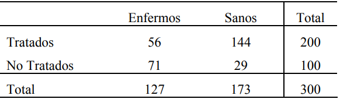

```{r setup, include=FALSE}
knitr::opts_chunk$set(echo = TRUE,
                      warning = FALSE,
                      eval = TRUE,
                      message = FALSE,
                      fig.align = "center")

library(ggplot2)
tema_gg <- theme_linedraw() +
  theme(axis.title.x = element_text(size = 5),
        axis.title.y = element_text(size = 5),
        plot.title = element_text(size = 8))
```

# Tablas de contingencia

## Introducción

- Ideal para analizar variables categóricas.
- Los datos se presentan como frecuencias de observaciones.
- De gran utilidad para verificar si los valores de dos factores son dependientes o independientes.
- El estadístico $\chi^2$ es útil para el análisis de variables categóricas

$$\chi^2 = \sum \frac{(O - E)^2}{E}$$

Donde:

- **O:** frecuencia observada.
- **E:** frecuencia esperada.

# Ejemplo

## Enunciado

Se dispone de 300 animales de laboratorio y se decide tratar a 200 con una vacuna experimental y dejar 100 como controles. Después de tratar al primer lote se expone a los 300 al contagio de la enfermedad en estudio. El recuento final, después de un período experimental adecuado, fue:

```{r, echo=FALSE, out.height="70px", out.width="250px"}

```

## Hipótesis

$$H_0: los\ dos\ factores\ o\ variables\ categóricas\ son\ independientes$$
$$H_0: los\ dos\ factores\ o\ variables\ categóricas\ no\ son\ independientes$$

## Solución con R (1/3)

```{r, collapse=TRUE}
tabla <- matrix(c(56, 144, 71, 29), nrow = 2, ncol = 2,
                byrow = TRUE)
colnames(tabla) <- c("Enfermos", "Sanos")
rownames(tabla) <- c("Vacunado", "No vacunado")
tabla
```

## Solución con R (2/3)

```{r, fig.width=4.5, fig.height=3.5}
mosaicplot(tabla, main = "Gráfico de mosaico")
```


## Solución con R (3/3)

- Función `chisq.test()`
    - `x`: tabla de datos.
    
```{r, collapse=TRUE}
prueba_chi2 <- chisq.test(tabla, correct = FALSE)
prueba_chi2
```

## Frecuencias observadas

```{r}
prueba_chi2$observed
```

## Frecuencias esperadass

```{r}
prueba_chi2$expected
```

¿De dónde salen estos valores esperados?

$$F_{esperada-vacunados} = \frac{200*127}{300} = 84.667$$

$$F_{esperada-sanos-vacunados} = \frac{200*173}{300} = 115.33$$