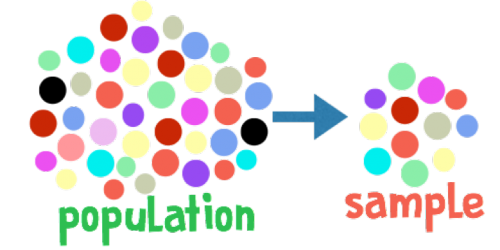
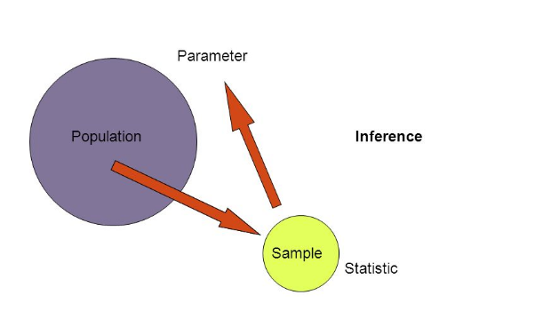
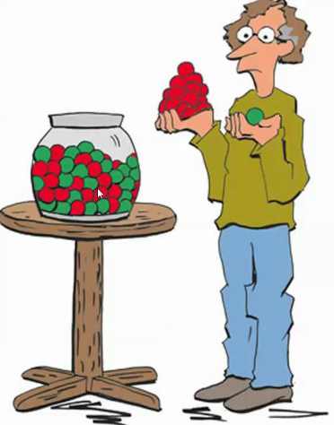

```{r setup, include=FALSE}
knitr::opts_chunk$set(echo = TRUE,
                      warning = FALSE,
                      eval = TRUE,
                      message = FALSE,
                      fig.align = "center")

library(ggplot2)
tema_gg <- theme_linedraw() +
  theme(axis.title.x = element_text(size = 5),
        axis.title.y = element_text(size = 5),
        plot.title = element_text(size = 8))
```

# Población y muestra

##

```{r, echo = FALSE, out.width="200px", out.height="100px"}

```

## Población: concepto

Una **población** se puede definir como el conjunto de elementos acotados en tiempo y espacio, con alguna característica medible o cuantifiable.

  - **Ejemplos:**
      - Animales, plantas, días de producción, semillas, personas, ciudades, paises. 
  - Acotados en **espacio y tiempo** por intereses específicos.
  - Si la población es finita, el **tamaño poblacional** es el número de elementos de la misma y se denota con $N$.  

## Muestra: concepto

- Generalmente, es difícil o impracticable examinar características de interés en la población completa, por esa razón se analiza una parte de ella y con base en la información relevante de ese fragmento, se hace inferencia o generalización sobre toda la población.
- Por **muestra** se entiende todo subconjunto de elementos u observaciones de la población.
- El **tamaño muestral** es el número de elementos u observaciones que constituyen la muestra y se denota con $n$.

## Idea general

```{r, echo = FALSE, out.width="270px", out.height="200px"}

```

# Conceptos

## Variable y tipos de variables

- **Variable:** una variable es un atributo o propiedad que difiere de alguna forma entre los elementos de una población. Todas las observaciones o mediciones sobre los elementos de una población tienen la particularidad de cambiar su estado o expresión, por ello se denominan **"variables"**; aquellas que no cumplen esta condición se denominan **"constantes"**. Las variables pueden ser **cuantitativas** o **cualitativas**.
    - **Variables cuantitativas continuas:** son aquellas que pueden asumir cualquier valor dentro de un intervalo. Medibles en la escala decimal.
        - *Intervalo:* el cero no representa ausencia de la característica
        - *Razón:* el cero representa ausencia de la característica
      - **Variables cuantitativas discretas:**  son aquellas características que asumen un número finito o infinito numerable de valores posibles. No medibles en la escala decimal.

## 

  - **Variables categóricas o cualitativas:** son aquellas características cuya escala de medida es un conjunto de categorias.
      - *Nominal:* no poseen orden (***ej.*** género, el color de semillas, la dirección del viento)
      - *Ordinal:* poseen orden (***ej.*** el grado de afección de una virosis vegetal, "alto", "medio" y "bajo")

## Parámetro, estadístico y estimador

  - **Parámetro:** valor de la *población* sobre el que se desea realizar inferencia a partir de *estadísticos* obtenidos de la muestra, que se denominan *estimadores*. Se denotan por letras griegas.
 - **Estadístico:** cualquier medida realizada sobre los valores de una variable. Se denotan con letras latinas. 
  - **Estimadores:** medidas de resumen que se calculan con el propósito de describir y caracterizar una muestra. Expresión matemática que permite cuantificar la estimación. Una buena estimación se caracteriza por:
      - No tener sesgo
      - Alto grado de precisión
      - Alto nivel de exactitud

## Hipótesis, error muestral y modelo

  - **Hipótesis:** supuestos realizados respecto a un parámetro o estadístico (***ej.*** media, proporción, desviación estándar, varianza)
  - **Error muestral:** denominado también *error de estimación*, determinado en gran medida por la observación y medición de variables en una muestra de la población completa.
  - **Modelo:**  conjunto de supuestos o presuposiciones acerca del fenómeno bajo estudio. Un modelo se puede definir como una abstracción matemática del mundo real.

# Muestreo

## Teoría del muestreo

Esta teoría define los fundamentos probabilísticos, distribuciones estadísticas, métodos o técnicas de selección, fórmulas de cálculo matemático de los errores muestrales, tablas y determinación del tamaño de muestra. Indica los procedimientos para extraer una muestra del colectivo bajo estudio, con la finalidad de analizar e inferir algo del universo total.

Los beneficios de realizar el muestreo son:

  - Ahorra dinero
  - Ahorra tiempo
  - Las muestras son más precisas
  
## Tipos de muestreo

  - *Probabilístico:* se utiliza un procedimiento de selección al azar y cada elemento de la población tiene **la misma probabilidad de ser seleccionado o incluido en la muestra**.
      - Muestreo aleatorio simple
      - Muestreo aleatorio sistemático
      - Muestreo estratificado
      - Muestreo por áreas o conglomerados
  - *No probabilístico:* las muestras se obtienen de un proceso que no ofrece a todos los elementos la misma oportunidad de ser seleccionados.
      - Muestreo por cuotas
      - Muestreo accidental o coincidental
      - Muestreo opinático
      - Muestreo de elección razonada

# Simulación con R

## Hombres y mujeres Bioestadíca 1 (grupo 3)

  - **Mujeres:** 17
  - **Hombres:** 14
  - **¿Proporción?**

```{r, echo = FALSE, out.width="250px", out.height="170px"}
knitr::include_graphics("images/hm.png")
```

## Tres muestreos en clase

  1. **Tamaño muestral:** 8 individuos
  2. **Tamaño muestral:** 16 individuos
  3. **Tamaño muestral:** 24 individuos
  
```{r, echo = FALSE, out.width="180px", out.height="150px"}

```

## Simulación con R: población

  1. 20 muestras de tamaño 15
  2. 50 muestras de tamaño 15
  3. 100 muestras de tamaño 15
  4. 10.000 muestras de tamaño 15

```{r}
mujeres <- 17
hombres <- 14
bio1 <- c(rep("Mujer", mujeres), rep("Hombre", hombres))
bio1
```

## Simulación con R: 20 muestras 

  - **Proporción de mujeres real:** 54.83%

```{r}
set.seed(1000)
t_muestra <- 20
muestras <- c()
for (i in 1:t_muestra) {
  muestras[i] = prop.table(table(sample(x = bio1,
                                        size = 15)))[2]
}
head(muestras)[1:4]
mean(muestras) #Proporción de mujeres promedio en 20 muestras
```

## Simulación con R: 50 muestras 

  - **Proporción de mujeres real:** 54.83%

```{r}
set.seed(1000)
t_muestra <- 50
muestras <- c()
for (i in 1:t_muestra) {
  muestras[i] = prop.table(table(sample(x = bio1,
                                        size = 15)))[2]
}
head(muestras)[1:4]
mean(muestras) #Proporción de mujeres promedio en 50 muestras
```

## Simulación con R: 100 muestras 

  - **Proporción de mujeres real:** 54.83%

```{r}
set.seed(1000)
t_muestra <- 100
muestras <- c()
for (i in 1:t_muestra) {
  muestras[i] = prop.table(table(sample(x = bio1,
                                        size = 15)))[2]
}
head(muestras)[1:4]
mean(muestras) #Proporción de mujeres promedio en 100 muestras
```

## Simulación con R: 10.000 muestras 

  - **Proporción de mujeres real:** 54.83%

```{r}
set.seed(1000)
t_muestra <- 10000
muestras <- c()
for (i in 1:t_muestra) {
  muestras[i] = prop.table(table(sample(x = bio1,
                                        size = 15)))[2]
}
head(muestras)[1:4]
mean(muestras) #Proporción de mujeres promedio en 10 mil muestras
```

## 

```{r, echo = FALSE, out.width="180px", out.height="150px"}
knitr::include_graphics("images/gracias.jpg")
```