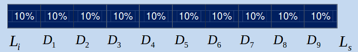

```{r setup, include=FALSE}
knitr::opts_chunk$set(echo = TRUE,
                      warning = FALSE,
                      eval = TRUE,
                      message = FALSE,
                      fig.align = "center")

library(ggplot2)
tema_gg <- theme_linedraw() +
  theme(axis.title.x = element_text(size = 5),
        axis.title.y = element_text(size = 5),
        plot.title = element_text(size = 8))
```

# Medidas de resumen para una variable

## Medidas de resumen

- Las medidas de resumen permiten caracterizar la información que aportan los $n$ datos de la muestra considerada.

- Los **estadísticos** o **valores típicos** pretenden caracterizar o describir la muestra, indicando el valor de la variable hacia el cual tienden a agruparse los datos.

# Medidas de tendencia central

## Medidas de tendencia central

- Las medidas de centralización son las más importantes, aunque no basta con ellas para resumir la información. 

## Media aritmética

- **Media aritmética ($\bar{x}$):** el promedio es la suma de los valores $x_{i}$ de las observaciones dividido por el tamaño $n$ de la muestra.
 
$$\bar{x}=\frac{\sum\nolimits_{i=1}^nxi}{n}=\frac{x_{1}+x_{2}+...+x_{n}}{n}$$

  - La media es susceptible a valores extremos.
  - Cuando se tienen variables discretas, es posible que el resultado de $\bar{x}$ no pertenezca al conjunto de valores posibles (***ej.*** el número de hermanos).
  
## Mediana

  - **Mediana ($Me$):** la mediana es el valor central en el sentido del orden. La mediana deja por encima y por debajo de ella, el 50% de los datos.
      
      - No se afecta por valores extremos. 
      - En distribuciones simétricas, la media es aproximadamente igual a la mediana.
      - En distribuciones con sesgo a la derecha (sesgo positivo), la media tiende a ser mayor que la mediana.
      - En distribuciones con sesgo a la izquierda (sesgo negativo) la media tiede a ser menor que la mediana.
      
## Moda y media ponderada

  - **Moda ($Mo$):** la moda es el valor que ocurre con mayor frecuencia, es decir, el dato que más se repite.
  
      - Unimodal: una sola moda
      - Bimodal: dos modas
      - Multimodal: más de dos modas
      
  - **Media ponderada ($Mp$):** es una medida donde todas las observaciones no poseen el mismo grado de importancia.
  
# Medidas de dispersión

## Rango 

Las medidas de dispersión expresan el grado de homogeneidad o heterogeneidad de los datos en torno a un valor central.

  - **Rango:** es la diferencia entre el valor máximo y el mínimo. $$Máximo - Mínimo$$

## Varianza  
  
  - **Varianza($S^2$):** proporciona una medida de dispersión relativa al tamaño muestral de las distintas observaciones respecto a la media aritmética $\bar{x}$. Se define como la suma de los cuadrados de las diferencias entre cada valor de la muestra y su media.
    
    - Para la población: $$\sigma^2=\frac{\sum\nolimits_{i=1}^n(x_{i}-\bar{x})}{N}^2$$

    - Para la muestra: $$S^2=\frac{\sum\nolimits_{i=1}^n(x_{i}-\bar{x})}{n-1}^2$$
    
## Desviación estándar

  - **Desviación estándar($S$):** se define como la raíz cuadrada de la varianza. Tiene la propiedad de estar definida en las mismas unidades de la variable analizada.
  
    - Para la población:
  $$\sigma=\sqrt{\sigma^2}$$
  
      - Para la muestra:
  $$S=\sqrt{S^2}$$

## Coeficiente de variación

  - **Coeficiente de variación($CV$):** se define como el cociente entre la desviación típica y la media aritmética, expresado en porcentaje.
  
$$CV=\frac{S}{\bar{x}} \times 100$$

# Medidas de posición

## Percentiles

Los percentiles, cuantiles y deciles indican la posición relativa de un dato respecto al resto de la muestra.

  - **Percentiles:** dividen la muestra en 100 partes iguales. Son los valores que dejan determinado porcentaje de observaciones por debajo de ellos. Por ejemplo, el percentil 10, es el valor superior al 10% de los datos, pero inferior al 90% restante.

```{r, echo = FALSE, out.width = "230px", out.height="70px"}

```

Ubicación del percentil $k$: $$P_{k}=\frac{k(n+1)}{100}$$

## Deciles

  - **Deciles:** dividen la muestra en 10 partes iguales.

```{r, echo = FALSE, out.width = "210px", out.height="70px"}

```

Ubicación del decil $k$: $$D_{k}=\frac{k(n+1)}{10}$$

## Cuartiles

  - **Cuartiles:** dividen la muestra en cuatro partes iguales.
  
      - Cuartil 1: 25% de las observaciones
      - Cuartil 2: 50% de las observaciones
      - Cuartil 3: 75% de las observaciones

```{r, echo = FALSE, out.width = "210px", out.height="70px"}

```

Ubicación del cuartil $k$: $$Q_{k}=\frac{k(n+1)}{4}$$

## Rango intercuartílico

  - **Rango intercuartil:** el rango intercuartílico (RIQ) se obtiene como la diferencia entre los cuartiles 3 (Q3) y 1 (Q1). La mitad de las observaciones se clasifican dentro de este rango.

```{r, echo = FALSE, out.width = "210px", out.height="70px"}

```

$$RIQ\ =\ Q3-Q1$$

# Medidas de distribución o forma

## Coeficiente de asimetría

 - **Coeficiente de asimetría ($g_{1}$):** indica el grado de simetría de la distribución de datos. Puede ser:
  
      - Distribución simétrica $si\ g_{1} = 0$
      - Distribución asimétrica negativa $si\ g_{1} < 0$
      - Distribución asimétrica positiva $si\ g_{1} > 0$

Fórmula del coeficiente de asimetría:

$$g_{1}=\left[\frac{{n}}{(n-1)(n-2)}\right]\left[\frac{\sum\nolimits_{i=1}^n(x_{i}-\bar{x})^3}{S^3}\right]$$

## Coeficiente de asimetría
      
```{r, echo = FALSE, out.width = "290px", out.height="210px"}

```

## Coeficiente de curtosis

  - **Coeficiente de curtosis ($g_{2}$):** evalua el grado de concentración de los datos alrededor de la media y de los extremos (o colas). Puede ser:
  
      - Distribución mesocúrtica $si\ g_{2}=0$
      - Distribución leptocúrtica $si\ g_{2}>0$
      - Distribución platicúrtica $si\ g_{2}<0$

Fórmula del coeficiente de curtosis:

$$g_{2}=\left[\frac{{n(n+1)}}{(n-1)(n-2)(n-3)}\right]\left[\frac{\sum\nolimits_{i=1}^n(x_{i}-\bar{x})^4}{S^4}\right]-\left[\frac{{3(n-1)^2}}{(n-2)(n-3)}\right]$$

## Coeficiente de curtosis

```{r, echo = FALSE, out.width = "290px", out.height="210px"}

```

## 

```{r, echo = FALSE, out.width="180px", out.height="150px"}
knitr::include_graphics("images/gracias.jpg")
```