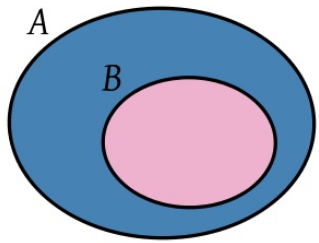
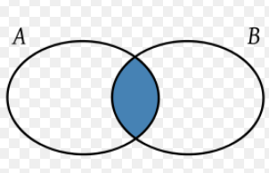
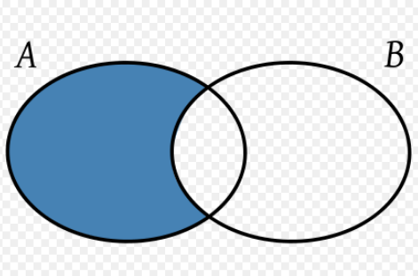
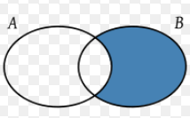
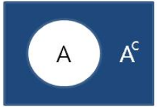

```{r setup, include=FALSE}
knitr::opts_chunk$set(echo = FALSE,
                      warning = FALSE,
                      eval = TRUE,
                      message = FALSE,
                      fig.align = "center")

library(ggplot2)
tema_gg <- theme_linedraw() +
  theme(axis.title.x = element_text(size = 5),
        axis.title.y = element_text(size = 5),
        plot.title = element_text(size = 8))
```

# Teoría de conjuntos

## Definición de conjunto

Un **conjunto** es una colección de objetos denominados elementos. Los elementos no se repiten dentro de un conjunto.

**Ejemplos:**

  - Conjuntos numéricos (naturales, enteros, racionales, reales)
  - Conjuntos sencillos $A=\{1, 2, 3, 4\}$
  - Conjunto vacío $\emptyset\ =\ \{\}$

El **cardinal** de un conjunto se define como el número de elementos de dicho conjunto (si este es finito). Por ejemplo:

  - Conjuntos infinitos: cardinal infinito
  - Conjuntos finitos: número de elementos del conjunto

Si $a$ es un elemento de $A$, entonces diremos que $a\ \in\ A$. En caso contrario, diremos que $a\ \notin\ A$.

## Formas de caracterizar un conjunto

  - Escribiendo el total de elementos del conjunto.
  - Definiendo una o varias propiedades de los elementos del conjunto.
  
## Subconjuntos (1/2)

```{r, out.width = "90px", out.height="55px"}

```

Si $A$ y $B$ son conjuntos, diremos que $B$ es subconjunto de $A$ si todo lo que está en $B$ también está en $A$. $$B \subseteq A$$

De lo contrario: $$B \not \subseteq A$$

## Subconjuntos (2/2)

**Ejemplo:**

Sea $A=\{1, 2, 3, 4,\ 5,\ 6\}$ y $B=\{2,\ 4,\ 6\}$, diremos que $B \subseteq A$

**Nota:** Para todo conjunto, por ejemplo, el conjunto $E$, siempre se cumple:

  - $E$ Está incluido en el mismo $E \subseteq E$.
  - $\emptyset \subseteq E$ (**razonamiento por contradicción**).

## Operaciones con conjuntos

Existen operaciones básicas que permiten manipular los conjuntos y sus elementos, tal cual como las operaciones aritméticas habituales, constituyendo el **álgebra de conjuntos.**

  - Unión
  - Intersección
  - Diferencia 
  - Complemento

## Unión

Sean $A$ y $B$ conjuntos, se define la unión de estos dos conjuntos como aquellos elementos que están en $A$ **o (disyunción)** están en $B$, se expresa de la siguiente manera: $$A \cup B$$

```{r, out.width = "90px", out.height="55px"}
knitr::include_graphics("images/union.png")
```

**Ejemplo:** Sean $A=\{1,2,3,4,5,6\}$ y $B=\{2,4,6,8\}$, obtener $A \cup B$. $$A \cup B=\{1,2,3,4,5,6,8\}$$. 

## Intersección

Sean $A$ y $B$ conjuntos, se define la intersección de estos dos conjuntos como aquellos elementos comunes a $A$ y $B$, es decir, aquellos elementos que están en $A$ **y (conjunción)** están en $B$; se expresa de la siguiente manera: $$A \cap B$$.

```{r, out.width = "90px", out.height="55px"}

```

**Ejemplo:** Sean $A=\{1,2,3,4,5,6\}$ y $B=\{2,4,6,8\}$, obtener $A \cap B$. $$A \cap B=\{2,4,6\}$$. 

## Diferencia (1/2)

Sean $A$ y $B$ conjuntos, se define la diferencia de $A$ y $B$ como aquellos elementos que están en $A$ y no están en $B$, se expresa de la siguiente manera: $$A-B$$ 

```{r, out.width = "90px", out.height="55px"}

```

## Diferencia (2/2)

$$B-A$$

```{r, out.width = "90px", out.height="55px"}

```

**Ejemplo:** Sean $A=\{1,2,3,4,5,6\}$ y $B=\{2,4,6,8\}$, obtener $A-B$ y $B-A$. $$A-B=\{1,3,5\}$$ $$B-A=\{8\}$$ 

## Complemento

Sean $A$ un subconjunto de $E$, $A \subseteq E$, se define el complento de $A$ como aquellos elementos que pertenecen a $E$, tales que no pertenecen a $A$, es decir, aquellos elementos que **no** están en $A$. Se expresa como: $$A^c$$

```{r, out.width = "90px", out.height="55px"}

```

**Ejemplo:** Sean $E=\{1,2,3,4,5,6,7,8,9,10\}$ y $A\ =\ números\ pares$, donde $A \subseteq E$. Hallar $A^c$. $$A^c=\{1,3,5,7,9\}$$

# Experimentos

## Tipos de experimentos

Existen dos tipos de fenómenos o experimentos en la naturaleza:

  - **Experimento determinístico:** aquél que produce los mismos resultados al repetirse bajo las mismas condiciones.
  - **Experimento aleatorio:** aquél que cuando se repite bajo las mismas condiciones produce resultados diferentes y no pueden ser predichos.

## Espacio muestral

La teoría de la probabilidad es la rama de las matemáticas que estudia los fenómenos o experimentos aleatorios. Inicialmente no es posible conocer los posibles resultados de un experimento aleatorio, por tanto, es conveniente agrupar en un **conjunto** a todos los resultados posibles.

El **espacio muestral** de un experimento aleatorio es el conjunto de todos los posibles resultados del experimento, denotado comunmente por la letra griega omega mayúscula $\Omega$ o con la letra $S$. 

**Ejemplo:** Si el experimento aleatorio consiste en lanzar un dado y observar el resultado, el espacio muestral $S$ es: $$S=\{1,2,3,4,5,6\}$$

## Eventos o sucecos

Se denomina **suceso** o **evento** a cualquier subconjunto del conjunto $\Omega$. Se denota conmunmente por la letra omega minúscula $\Omega$.

**Ejemplo:** continuando con el ejemplo de lanzar un dado y observar el resultado, un evento  podría ser: $$A=\{2,4,6\}$$ 

## Eventos mutuamente excluyentes

Dos eventos de un espacio muestral $\Omega$ se consideran **mutuamente excluyentes** si no contienen elementos en común, es decir, $A \cap B=\emptyset$

Dos eventos de un espacio muestral $\Omega$ se consideran **independientes** si el resultado de uno no influye en la aparación del otro.

## Operaciones entre eventos

  - Unión $A \cup B$
  - Intersección $A \cap B$
  - Diferencia $A-B$ o $B-A$
  - Complemento $A^c$

# Ejemplos

## Ejemplo 1 

Considere un experimento aleatorio que consta de la observación de 3 semillas en determinado orden, cada una de las cuales puede ser **sana** (+) o **enferma** (-). Dado $A=\{+--,\ -+-,\ --+\}$ y $B=\{++-,\ -++,\ +-+\}$, Hallar:

  - El espacio muestral $S$
  - $A \cap B$
  - $A \cup B$
  - $A-B$
  - $B-A$
  - $A^c$ y $B^c$
  - ¿Son mutuamente excluyentes?
  
## Ejemplo 2

Considere un experimento aleatorio que consta de la observación de 4 partos de una vaca ($n = 4$), cada uno de los cuales puede ser hembra (H) o macho (M). Dado: $$A=\{HMHM,\ MMHM,\ HHHM, MMHH\}$$ y $$B=\{MHMH,\ MMHH,\ HHMM, HMHM\}$$

Hallar:

  - El espacio muestral $S$
  - $A \cap B$
  - $A \cup B$
  - $A-B$
  - $B-A$
  - $A^c$ y $B^c$
  - ¿Son mutuamente excluyentes?  