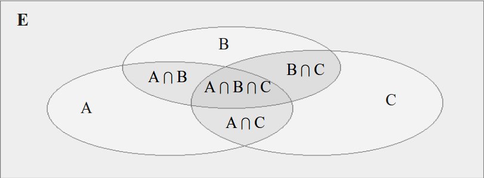
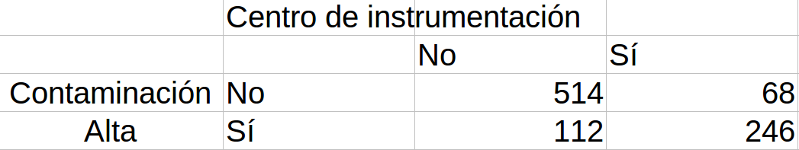

```{r setup, include=FALSE}
knitr::opts_chunk$set(echo = FALSE,
                      warning = FALSE,
                      eval = TRUE,
                      message = FALSE,
                      fig.align = "center")

library(ggplot2)
tema_gg <- theme_linedraw() +
  theme(axis.title.x = element_text(size = 5),
        axis.title.y = element_text(size = 5),
        plot.title = element_text(size = 8))
```

# Tećnicas de conteo

## Regla de la multiplicación

Si un proceso consta de $k$ partes, donde la primera parte se puede hacer de $n_1$ formas, la segunda parte de $n_2$ formas, ..., y la $k-ésima$ parte de $n_k$ formas, entonces el proceso puede realizar de: $$n_1\ * n_2\ *...*n_k$$

## Combinaciones

¿Cuántos subconjuntos de tamaño $r$ se pueden formar de un conjunto de tamaño $n$?

$${n \choose r}=\frac{{n!}}{r!(n-r)!}$$

**Ejemplo:** ¿cuántos subconjuntos de tamaño 2 se puede obtener de un conjunto de cuatro personas?

$${4 \choose 2}=\frac{{4!}}{2!(4-2)!}=6$$

## Permutaciones

¿Cuántos subconjuntos **ordenados** de tamaño $r$ se pueden formar de un conjunto de tamaño $n$?

$${n \choose r}=\frac{{n!}}{(n-r)!}$$

**Ejemplo:** ¿cuántos subconjuntos de tamaño 2 se puede obtener de un conjunto de cuatro personas, si el primero en ser elegido será presidente y el segundo el vicepresidente?

$${4 \choose 2}=\frac{{4!}}{(4-2)!}=12$$

# Probablidad

## Concepto

Dado un experimento aleatorio con un especio de $n$ sucesos o eventos elementales $\Omega$, la probabilidad del suceso $A$, que se designa mediante $P(A)$, es el cociente entre la cantidad de casos favorables para la ocurrencia de $A$ y la de casos posibles. La probabilidad de ocurrencia de cada suceso elemental es $1/n$, por tanto, se denominan equiprobables.

  - $0\ \leq\ P(A) \leq\ 1$
  - $P(\Omega)=1$
  - Si $A1,\ A2,\ A3\,...$ es una colección infinita de eventos mutuamente excluyentes, entonces:

$$P(A_1 \cup A_2\  \cup A_3...)=\sum\nolimits_{i=1}^\infty P(A_i)$$

## Propiedades

  1. $P(\emptyset)=0$ (suceso imposible)
  2. Para cualquier evento $P(E) \leq\ 1$
  3. $P(E^c)=1-P(E)$
  4. Si $A \subseteq B$, entonces, $P(A) \leq\ P(B)$
  5. $P(A-B)=P(A)-P(A \cap B)$
  6. **Regla de la adición:** $P(A \cup B)=P(A)+P(B)-P(A \cap B)$  
  6.1 **Regla de la adición (A, B y C):**
  
$$P(A \cup B \cup C)=P(A)+P(B)+P(C)-P(A \cap B)-P(A \cap C)-P(B \cap C)+P(A \cap B \cap C)$$

```{r, out.width = "90px", out.height="55px"}

```


## Enfoques para el cálculo de probabilidades

  - Clásico: 

$$P(A)=\frac{{n_A}}{n}$$

  - Frecuentista:

$$P(A)=\frac{{Número\ de\ veces\ que\ se\ presentó\ A}}{Número\ de\ veces\ que\ se\ observó\ el\ experimento}$$

  - Subjetivo:
  
$$P(A)\ =\ Criterio\ de\ un\ experto$$

# Ejemplos

## Ejemplo 1

  - Se realizó una encuesta en determinada ciudad sobre medio de transporte y se encontró que el 70% usan servicios públicos de transporte, 40% usa transporte particular y el 30% usan ambos tipos. Calcular la probabilidad de que se use algún tipo de transporte. **Rta: 0.8**

## Ejemplo 2
  
  - De la producción de plántulas de determinadas especificaciones, surge que el 5% de ellas no posee el largo requerido, el 7% no tiene el diámetro requerido y el 2% tiene ambas. Si se elige una plántula al azar, cuál es la probabilidad de:
  
      - Tenga al menos uno de los dos defectos (**Rta: 0.10**)
      - Tenga sólo el defecto del largo (**Rta: 0.03**)
      - Tenga solo uno de los dos (**Rta: 0.08**)
      - No tenga defectos (**Rta: 0.90**)

## Ejemplo 3
  
  - La siguiente imagen muestra los resultados de 940 obleas de un proceso de fabricación de semiconductores. Se elige al azar una oblea de la tabla. Sea $A$ el evento en que la oblea tiene altos niveles de contaminación y $B$ el evento en que la oblea está en el centro de atención electrónica. Obtener:
  
    - $P(A)$ (**Rta: 0.38085**)
    - $P(B)$ (**Rta: 0.33404**)
    - $P(A \cap B)$ (**Rta: 0.2617**)
    - $P(A \cup B)$ (**Rta: 0.45319**)
    - $P(A-B)$ (**Rta: 0.11915**)

```{r, out.width = "120px", out.height="50px"}

```

## Ejemplo 4

  - En un sistema de producción de hortalizas se detectan tres plagas. El 25% de las plantas tiene la enfermedad A, el 20% B y el 30% C. El 12% la A y B, el 10% la A y C, el 11% B y C y el 5% tiene las tres enfermedades. Obtener:
    - El diagrama de Venn para representar el enunciado.
    - La probabilidad de que una planta posea alguna de las enfermedades. (**Rta: 0.47**)
    - La probabilidad de que una planta posea la enfermedad A pero no la B.  (**Rta: 0.13**)
    - La probabilidad de que una planta posea la enfermedad B y C pero no la A.  (**Rta: 0.06**)

## Ejemplo 5
  
  - Se tiene un lote de 200 animales, de los cuales 88 requieren se vacunados y lo están, 28 necesitan la vacuna pero no lo están, 4 no necesitan la vacuna pero están vacunados, 80 no necesitan la vacuna y no están vacunados. Determine las probabilidades para los siguientes eventos:
  
    - El animal requiere ser vacunado  (**Rta: 0.58**)
    - El animal requiere ser vacunado pero no lo está (**Rta: 0.14**)
    - El animal está vacunado, sea que lo requiera o no.  (**Rta: 0.46**)
