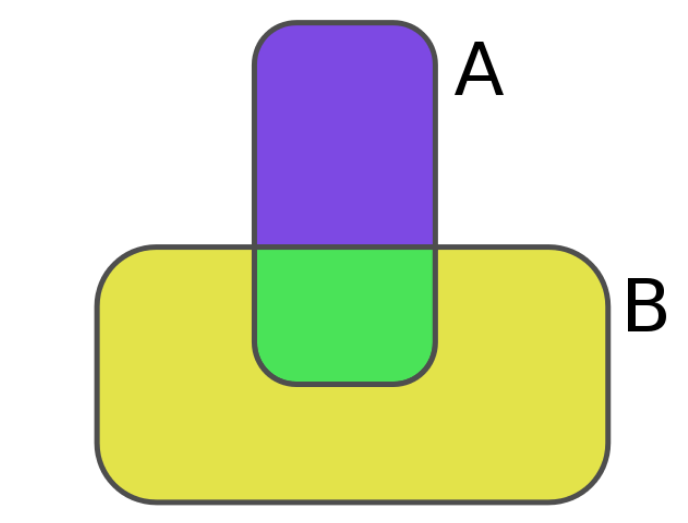
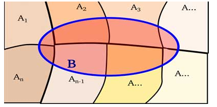

```{r setup, include=FALSE}
knitr::opts_chunk$set(echo = FALSE,
                      warning = FALSE,
                      eval = TRUE,
                      message = FALSE,
                      fig.align = "center")

library(ggplot2)
tema_gg <- theme_linedraw() +
  theme(axis.title.x = element_text(size = 5),
        axis.title.y = element_text(size = 5),
        plot.title = element_text(size = 8))
```

# Probabilidad condicional

## Probabilidad condicional (1/2)

Para dos eventos $A$ y $B$, con $P(B) \geq 0$,

$$P(A|B)=\frac{{P(A \cap B)}}{P(B)}$$
$$=> Probabilidad\ de\ que\ suceda\ A,\ dado\ que\ ya\ sucedió\ B$$

**Nota:** $P(A|B)$ no representa lo mismo que $P(B|A)$.

Las probabilidades condicionales, satisfacen los siguientes axiomas:

  - $P(\Omega|B)=1$
  - $P[(A \cup C)|B]=P(A|B)+P(C|B)$, si y solo si $P(A \cap C)=\emptyset$

## Probabilidad condicional (2/2)

```{r, out.width = "290px", out.height="130px", fig.align="center"}

```

## Ejemplo (1/2)

- **Ejemplo 1:** se realizó una encuesta con la finalidad de determinar hábitos de lectura en hombres y mujeres. El resultado se resume en la siguiente tabla:

| Género | Le gusta leer | No le gusta leer | Total |
| :---: | :---: | :---: | :---: |
| Hombre | 40 | 20 | 60 |
| Mujer | 50 | 10 | 60 |
| Total | 90 | 30 |  120 |

## Ejemplo (2/2)

Si se elige una persona al azar, calcular:

  - La probabilidad de que sea mujer. **Rta: 0.50**
  - La probabilidad de que sea mujer y le guste leer. **Rta: 0.42**
  - La probabilidd de que sea hombre. **Rta: 0.50**
  - La probabilidad de que le guste leer dado que es mujer. **Rta: 0.84**
  - La probabilidad de que sea hombre o mujer. **Rta: 1.0**
    
# Probabilidad de la intersección (regla de la multiplicación)

## Probabilidad de la intersección

Contribuye al cálculo de probabilidades de dos eventos simultáneos. Si $A$ y $B$ son dos eventos cualquiera (dependientes) en un espacio muestral $S$ y $P(A) \neq 0$, entonces: $$P(A \cap B)=P(A)P(B|A)$$

## Ejemplo

  - **Ejemplo 1:** la urna A contiene cuatro bolas rojas y tres azules, mientras que la urna B contiene ocho bolas rojas y dos azules. Se toma un bola de la urna A (sin ver su color) y se deposita en la urna B, para luego elegir una bola de esta última. Calcular la probabilidad de que ambas bolas elegidas de las urnas sean rojas. **Rta: 0.4675**
  
# Teorema de probabilidad total

## Probabilidad total (1/2)

  El teorema o regla de la probabilidad total, permite obtener probabilidades marginales o de eventos simples en función de los elementos de una partición. Diremos que si $A_1,A_2,...,A_k$ son eventos que constituyen una **partición** $A_i \cap A_j = \emptyset\ \wedge\ \ \bigcup_{i=1}^{k} A_i=S$, entonces: $$P(B)=P(B \cap A_1)+P(B\cap A_2)+P(B\cap A_3)+...+P(B\cap A_k)$$

## Probabilidad total (2/2)

```{r, out.width = "270px", out.height="110px", fig.align="center"}

```

## Ejemplo

  - **Ejemplo 1:** una empresa del sector agropecuario recarga sus extintores para incendios con tres empresas diferentes A, B y C. De registros históricos se sabe que el porcentaje de recargas defectuosas de A, B y C son 3%, 4% y 6%, respectivamente. El porcentaje de recargas realizadas por la empresa en cada una de las empresas ha sido 35%, 45% y 20% para A, B y C, respectivamente. El día de ayer se recibió un extintor recargado pero se desconoce la procedencia. ¿Cuál es la probabilidad de que esté defectuoso? **Rta: 0.0405**
    
# Teorema de Bayes

## Teorema de Bayes (1/2)

Se usa para responder preguntas de tipo **condicional**. Diremos que si $A_1,A_2,...,A_k$ son eventos que constituyen una **partición** del espacio muestral $S$ con $P(A_i) > 0,\ para\ i=1,2,...,k$, entonces para cualquier evento $B$ en $S$ tal que $P(B) > 0$, se tiene:

  - Causa $A_r$
  - Efecto $B$
  - $P(A_r|B)$: dado que se observó el efecto $B$, cuál es la probabilidad de que la causa haya sido $A_r$.

$$P(A_r|B)=\frac{{P(A_r)P(B|A_r)}}{\sum\nolimits_{i=1}^k P(A_i)P(B|A_i)}=\frac{{P(A_r \cap B)}}{P(A)}$$

## Ejemplo

  - **Ejemplo 1:** hay dos métodos de capacitación en una empresa. El porcentaje de fracaso del método A es 20% y el de B 10%; sin embargo, como el método B es más costoso se aplica solamente el 30% del tiempo (el otro 70% se emplea A). Un trabajador recibió la capacitación con uno de los métodos pero **no aprendió la destreza**. ¿Cuál es la probabilidad de que el trabajador haya sido capacitado a través del método A? **Rta: 0.8235**

# Ejercicios
    
## Ejercicios (1/4)

 - **Ejercicio 1:** En una cadena de televisión se hizo una encuesta a 2500 personas para saber la audiencia de un debate y una película, ambos emitidos en horas distintas. 2100 vieron la película, 1500 vieron el debate y 350 no vieron ninguno de los dos programas. Si se elige una persona al azar, obtener:
  
    - La probabilidad de que viera la película y el debate. **Rta: 0.58**
    - La probabilidad de que viera la película, sabiendo que vio el debate. **Rta: 0.9667**
    - Sabiendo que vio la película, ¿cuál es la probabilidad de que viera el debate? **Rta: 0.6904**
    
## Ejercicios (2/4)

  - **Ejercicio 2:** de una baraja estándar de 52 cartas, sea $A$ el evento de sacar un As en la primera extracción y $B$ sacar un As en la segunda extracción. Calcular la probabilidad de sacar dos Ases en dos extracciones sin devolver la carta extraída. **Rta: 0.004521**

## Ejercicios (3/4)

  - **Ejercicio 3:** se registran datos para el uso de gafas de sol en hombres y mujeres. Se tiene que de 17 hombres 5 utilizan gafas y de 20 mujeres 8 utilizan gafas. Obtener:
    - La probabilidad de elegir una persona al azar y que use gafas. **Rta: 0.3513**
    - La probabilidad de elegir una persona al azar y que no use gafas. **Rta: 0.6486** 

## Ejercicios (4/4)

  - **Ejercicio 4:** los clientes de una empresa se encargan de evaluar los diseños preliminares de varios productos. Por registros históricos, se sabe que en el pasado, el 95% de los productos con mayor éxito en el mercado recibieron buenas evaluaciones, el 60% de los productos con éxito moderado recibieron buenas evaluaciones y el 10% de los productos con poco éxito recibieron buenas evaluaciones. Además, el 40% de los productos ha tenido mayor éxito, el 35% éxito moderado y el 25% una baja aceptación. A partir de la información, obtener:
  
    - Si un nuevo diseño obtiene una buena evaluación, ¿cuál es la probabilidad de que se convierta en un producto de gran éxito? **Rta: 0.6178**
    - Si un producto no obtiene una buena evaluación, ¿cuál es la probabilidad de que se convierta en un producto de gran éxito? **Rta: 0.0519**