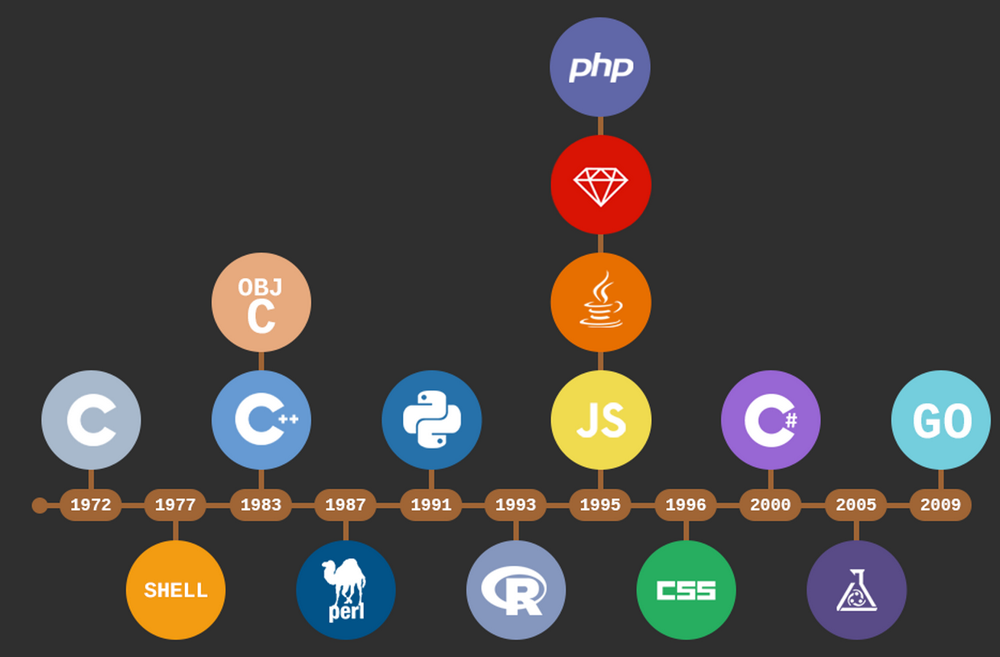

```{r setup, include=FALSE}
knitr::opts_chunk$set(echo = TRUE,
                      warning = FALSE,
                      eval = TRUE,
                      message = FALSE,
                      fig.align = "center")

library(ggplot2)
tema_gg <- theme_linedraw() +
  theme(axis.title.x = element_text(size = 5),
        axis.title.y = element_text(size = 5),
        plot.title = element_text(size = 8))
```

# ¿Qué es R?

##

```{r, echo = FALSE, out.width="150px", out.height="120px"}

```

`R` es un lenguaje de distribución libre (bajo la licencia [GPL - *General Public Licence*](https://en.wikipedia.org/wiki/GNU_General_Public_License)), interpretado y de gran uso en la manipulación de datos para el cómputo estadístico y gráfico. Disponible para Linux, MacOS y Windows.

## Línea del tiempo lenguajes de programación

```{r, echo = FALSE, out.width="220px", out.height="140px"}

```

`R` fue creado por Ross Ihaka y Robert Gentleman a principios de los años 90 en Nueva Zelanda, y puede ser definido como una implementación del lenguaje `S`, este último desarrollado en AT&T por John Chambers, Rick Becker y Allan Wilks.

# ¿Qué es un lenguaje de programación?

##

```{r, echo = FALSE, out.width="250px", out.height="170px"}

```

# Características de R

##

- Sintaxis similar a S
- Capacidad de graficación robusta
- Modo interactivo
- Comunidad dinámica de R
- Software Libre:
    - Libertad de ejecutar el programa
    - Acceder al código fuente
    - Redistribuible
    - Mejoras compartidas
    
# "Desventajas" de R

##

- Tecnología "vieja" > 40 años
- Sistema de graficación 3d
- Objetos en memoria
- No es ideal para todo

# Diseño del lenguaje

##

- Bibliotecas (sistema base) _R Base Core_.
- Bibliotecas adicionales.
- Más de 12.000 bibliotecas en el [CRAN.](https://cran.r-project.org/)
- _R Development Core Team_ financiado por R Foundation.

# ¿Cómo se ve R?

##

```{r, echo = FALSE, out.width="270px", out.height="150px"}

```

# ¿Qué es RStudio? 

##

```{r, echo = FALSE, out.width="150px", out.height="80px"}
knitr::include_graphics("images/rstudio.png")
```

`R-Studio` es un entorno de desarrollo integrado (IDE) de fuente abierta para el lenguaje de programación `R`, que ofrece gran variedad de herramientas tecnológicas de vanguardia para la importación, administración, visualización, modelación y comunicación de la información. (Para más información consultar [RStudio](https://www.rstudio.com/)).

# ¿Cómo se ve RStudio? 

##

```{r, echo = FALSE, out.width="310px", out.height="230px"}

```

# Entradas básicas en R

## Ejecutar línea de código

```{r, echo = FALSE, out.width="230px", out.height="130px"}

```

## Limpiar consola

```{r, echo = FALSE, out.width="220px", out.height="80px"}
knitr::include_graphics("images/limpiar.png")
```

## Comentarios en R

```{r, echo = FALSE, out.width="250px", out.height="130px"}

```

```{r}
# Esta es una suma
2 + 2
```

## Operaciones básicas

  - **Suma:** `+`
  - **Resta:** `-`
  - **Multiplicación:** `*`
  - **División:** `/`
  - **Potencia:** `^`
  - **Raíz cuadrada:** `sqrt()`
  - **Valor absoluto:** `abs()`
  
## Ejemplos de operaciones básicas

```{r}
# Suma
4500 + 8900
```

```{r}
# Resta
4500 - 8900
```

```{r}
# Multiplicación
4 * 5
```

##

```{r}
# División
4500 - 8900
```

```{r}
# Potencia
2^2
```

```{r}
# Raíz cuadrada
sqrt(9)
```

```{r}
# Valor absoluto
abs(-10)
```

# Guardar un script de R

## Pasos para guardar un archivo ***.R***

  1. Click en **file**
  2. Click en **Save with Encoding**
  3. Elegir codificación **UTF-8**
  4. Elegir el directorio donde será almacenado el archivo
  5. Agregar un nombre (por defecto se agrega la extensión ***.R***)
      + No utilice nombres separados (ej. "mi cod.R") - **MAL**
      + No utilice acentuación (ej. "mi código.R") - **MAL**
      + Use nombres cortos y concatenados (ej. "mi_codigo.R") - **BIEN**
  6. Diviértase con R    

## 

```{r, echo = FALSE, out.width="180px", out.height="150px"}
knitr::include_graphics("images/gracias.jpg")
```